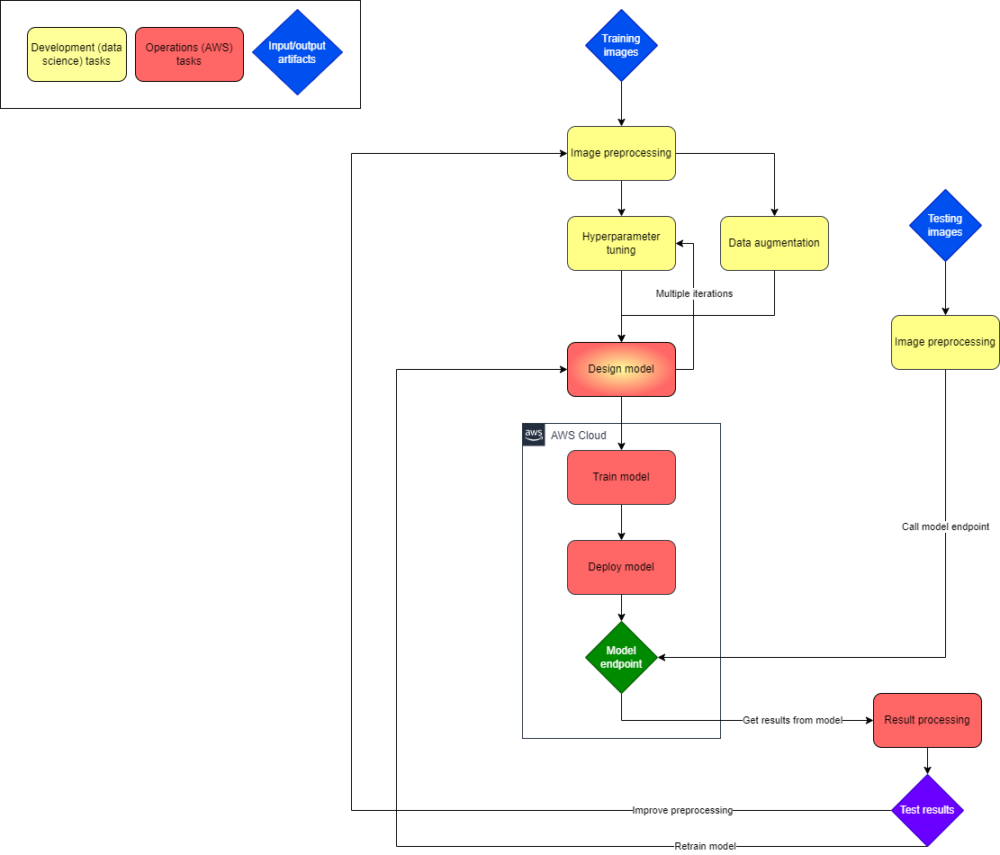

# river-blindness

## Recommended materials

* 🚨 Michigan University: [Deep Learning for Computer vision semester](https://www.youtube.com/playlist?list=PL5-TkQAfAZFbzxjBHtzdVCWE0Zbhomg7r)
* Information on bounding boxes: [Image Processing Techniques: What Are Bounding Boxes?](https://keymakr.com/blog/what-are-bounding-boxes/)
  * [How Bounding Box Enables Object Detection?](https://medium.com/tech-break/how-bounding-box-enables-object-detection-999b3059974e)
* Information on the metric IoU: [Intersection over Union (IoU) for object detection](https://pyimagesearch.com/2016/11/07/intersection-over-union-iou-for-object-detection/)
* 

## 🌴 Vacation plans

* Ane
  * [11-15] July
  * Around 10 days sometime in the beginning of August
* Eldar
* Mohammed
* Sangmeng
  * [11-15] July
* Sebastian

## Proposed project architecture

Initial architecture proposal by Ane:

2 main pipelines:

1. Training
   1. Input artifact: testing images
   2. Image preprocessing
   3. Data augmentation
   4. Hyperparameter tuning
   5. Design model
   6. Train model (steps 3 and 4 are repeated multiple times until finding appropriate hyperparameters)
   7. Deploy model
   8. Output artifact: model endpoint
2. Testing
   1. Input artifact: testing images
   2. Image preprocessing (same as in training pipeline)
   3. Call model endpoint
   4. Retrieve and parse results
   5. Output artifacts: test results

Based on test results, the model might be retrained, the preprocessing algorithm modified, etc.

* Yellow boxes are meant to be development steps (data science related)
* Red boxes are meant to be operations steps (AWS related)
  * At least model training and 
* Rhombus is for artifacts
  * Blue is input artifacts, images
  * Green is the model endpoint
  * Purple is test results, which we will use to improve our system

